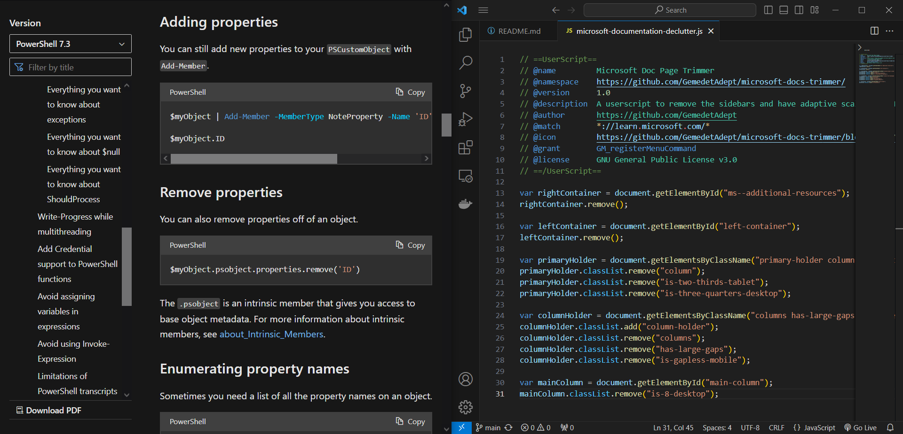
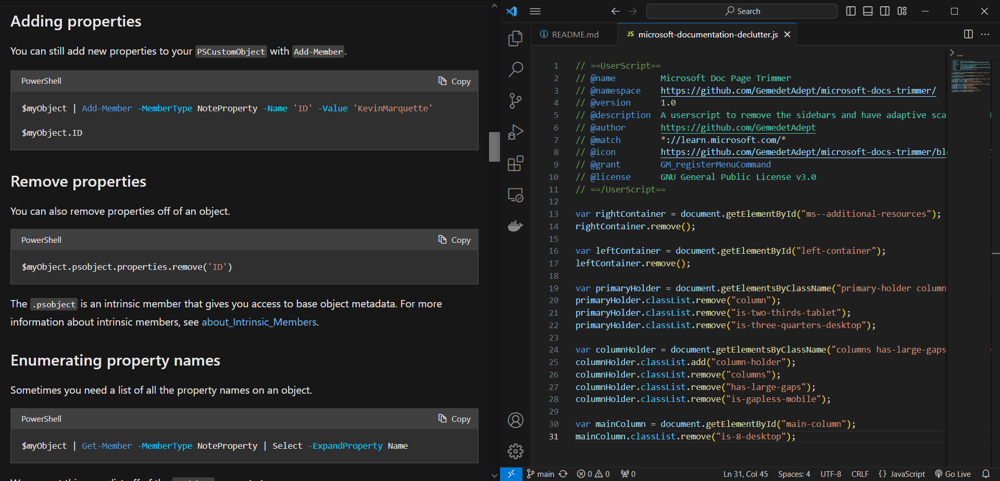

# Microsoft Doc Page Trimmer
A userscript to remove the sidebars and have adaptive scaling on Microsoft's documentation pages.

When I'm referencing documentation for the .NET framework, I often have to dock my browser and have it side-by-side with my IDE. Issue is, when it's at half size, the side bars scrunch up the text and shrink the code blocks. So, I did what all programmers would do in this situation: tell yourself it's a five-minute adventure — in-and-out — and then spend far too much time to fix a tiny problem that no-one else has.

Planned:
* A toggle option so that you don't need to reload the userscript every time you want to show/hide the sidebars.

## Screenshots

### Userscript disabled

### Userscript enabled

By: 
G
e
m
e
d
e
t
A
d
e
p
t